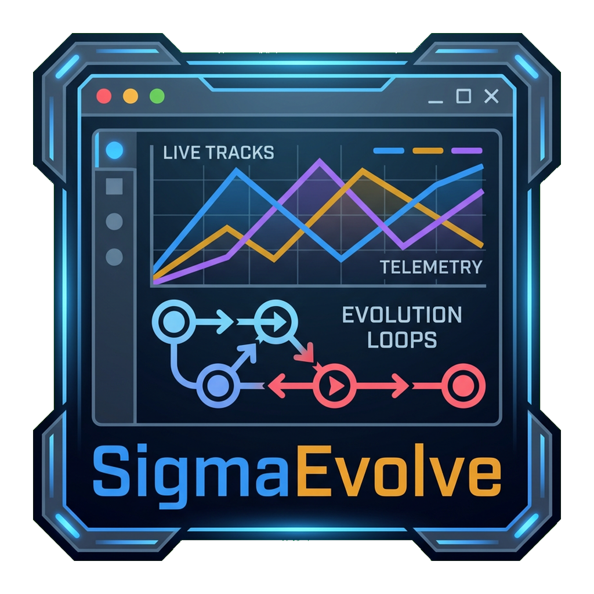

# SigmaEvolve Dashboard

Live dashboard for browsing SigmaEvolve experiment tracks, trial state, and evaluation telemetry from a shared Postgres database.

## Requirements

- Node.js 20+
- A reachable Postgres instance exposed through `DATABASE_URL`

## Local Development

```bash
npm install
cp .env.example .env.local
npm run dev
```

The app starts on `http://localhost:3000`. The root route redirects to the newest track when data exists; otherwise it shows an empty-state screen until the Python harness writes tracks into the shared database.

## Environment

- `DATABASE_URL`: Postgres connection string used for track and trial queries.
- `NEXT_PUBLIC_SITE_URL`: Absolute production URL used for canonical metadata, Open Graph URLs, `robots.txt`, and `sitemap.xml`.

## Commands

```bash
npm run dev
npm run build
npm run start
npm run test
```
