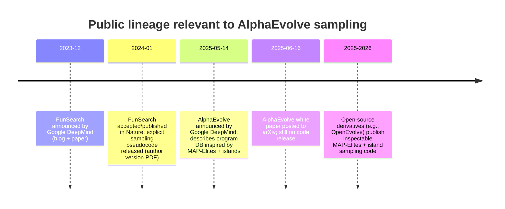

# AlphaEvolve Sampling Algorithm Implementation Deep Dive

## Executive summary

AlphaEvolve’s *exact* sampling algorithm (in the sense of “the concrete program-selection and randomness procedures used by the closed-source system”) is **not publicly specified in source code** as of March 26, 2026. The official white paper and blog post describe *what is sampled* (previously discovered programs to build prompts) and *the high-level evolutionary structure* (a program database implementing an evolutionary algorithm inspired by MAP-Elites and island population models), but they do **not** publish the full selection distributions, temperature schedules, PRNG/seed handling, or acceptance/rejection internals needed for a line-by-line implementation audit. citeturn26search2turn8view0

The most rigorous, primary-source description of a closely related sampling mechanism is **FunSearch** (DeepMind’s earlier, Nature-accepted system that AlphaEvolve explicitly “extends”). FunSearch provides **explicit formulas and pseudocode** for sampling: (1) uniformly sampling an island, (2) Boltzmann/softmax sampling of clusters using a temperature schedule, (3) sampling programs within clusters favoring shorter programs, and (4) periodic island resets that discard weak islands and re-seed them from strong ones. citeturn35view0turn36view2turn36view3turn36view4

Because AlphaEvolve’s public docs do not disclose equivalent low-level details, the strongest “implementation-level” evidence comes from **open-source reimplementations** that claim inspiration or partial replication. The most prominent is entity["organization","OpenEvolve","alphaevolve-inspired repo"], which implements a **MAP-Elites + island hybrid** with an explicit *mixture* parent-selection policy (exploration vs exploitation vs random/weighted), explicit defaults for selection ratios, and explicit seed/PRNG behavior. This is **not authoritative for AlphaEvolve**, but it is a concrete, inspectable proxy for how a MAP-Elites+island prompt sampler can be operationalized. citeturn9view0turn21view0turn22view0

**Bottom line (with confidence):**
- **High confidence:** AlphaEvolve samples prior programs from a program database to construct prompts; the database follows an evolutionary algorithm inspired by MAP-Elites and island models; evaluators gate what enters the database. citeturn26search2turn8view0  
- **High confidence (for FunSearch, not AlphaEvolve):** exact island/cluster/program sampling includes Boltzmann selection with an explicit temperature schedule and periodic island resets. citeturn36view0turn36view2turn36view3turn36view4  
- **Medium confidence (inference for AlphaEvolve):** AlphaEvolve likely replaces FunSearch’s “cluster-by-signature” archive with MAP-Elites-style elites over feature dimensions, while retaining island-style diversity maintenance. This inference is consistent with AlphaEvolve’s own “MAP-Elites + island” statement, but the exact probability laws remain undisclosed. citeturn26search2  
- **Low confidence:** any specific temperature/annealing schedule *inside AlphaEvolve’s* program-selection step or token-sampling step (no official disclosure). citeturn26search2turn8view0  

## Evidence base, scope, and confidence framework

This report prioritizes primary/official sources and separates **what is proven** from **what is inferred**:

Primary sources used:
- AlphaEvolve white paper (DeepMind-hosted PDF) and official blog announcement. citeturn26search2turn8view0  
- FunSearch “author’s version accepted in Nature” (DeepMind-hosted PDF), which contains explicit sampling formulas and pseudocode. citeturn35view0turn36view0turn36view3turn36view4  
- Open-source codebase entity["organization","OpenEvolve","alphaevolve-inspired repo"] as a transparent, inspectable implementation of a MAP-Elites+island prompt-sampling database (explicitly labeled as a proxy rather than authoritative). citeturn9view0turn21view0turn22view0turn25view5  

Confidence levels:
- **High confidence:** directly stated in official/primary documentation or explicit pseudocode.  
- **Medium confidence:** strongly implied by multiple primary sources, but missing a full spec for AlphaEvolve.  
- **Low confidence:** proposed as a plausible implementation detail, supported mainly by third-party open-source replications.

Scope note: “Sampling algorithm” is interpreted broadly as (a) **program/inspiration sampling** from a program database to build prompts, and (b) **randomness controls** (seeds, temperature schedules, and selection distributions) that materially affect that sampling and the downstream LLM generation process.

## What is publicly known about AlphaEvolve’s sampling from official sources

AlphaEvolve is presented as an evolutionary coding agent in which a **Prompt sampler** constructs “rich prompts” using programs stored in a **Program database**; LLMs generate modifications; evaluators run/score them; and results flow back into the database. citeturn26search2turn8view0

Two official statements matter most for determining the *type* of sampling algorithm:
- The program database “implements an evolutionary algorithm” that determines which programs are used for future prompts (blog-level description). citeturn8view0  
- The system’s evolutionary mechanism is “inspired by MAP-Elites and island-based population models” (white paper description). citeturn6view0turn26search2  

The white paper also indicates that prompt generation can include **stochastic formatting**, with template placeholders instantiated using “probability distributions provided in a separate config file,” but it does not publish that config nor define the distributions or parameters. citeturn6view0turn26search2  

AlphaEvolve further uses an ensemble of LLMs (e.g., breadth vs depth models) according to the blog post; however, the **token-sampling parameters** (temperature/top-p/seed) are not specified in the public AlphaEvolve materials. citeturn8view0turn26search2  

image_group{"layout":"carousel","aspect_ratio":"16:9","query":["AlphaEvolve prompt sampler program database diagram","Google DeepMind AlphaEvolve architecture figure prompt sampler evaluators"],"num_per_query":1}

### What is missing (and therefore cannot be “precisely” verified) from official AlphaEvolve sources
The official AlphaEvolve materials do not disclose:
- the exact **selection distributions** (e.g., softmax vs tournament vs fitness-proportional) used to pick parent programs/inspirations,  
- any **temperature/annealing schedules** used for program selection (distinct from LLM token temperature),  
- explicit **accept/reject rules** beyond “evaluators verify/run/score” and then store in the database,  
- **PRNG/seed handling** (global seeding, per-run seeds, per-call seeds), or  
- versioned changes to these mechanics across internal releases. citeturn26search2turn8view0  

Because these are precisely the attributes requested, the rest of this report reconstructs likely mechanics using (1) the closest explicitly specified predecessor (FunSearch) and (2) line-referenced open-source proxy code (OpenEvolve), with explicit confidence labeling.

## Sampling algorithms in adjacent primary sources: FunSearch’s exact mechanism

AlphaEvolve is explicitly positioned as extending FunSearch. citeturn34search13turn26search2  
FunSearch therefore provides the best available **primary-source** “ground truth” on how DeepMind has previously implemented LLM-guided evolutionary **prompt sampling**.

### Algorithm type and data structure

FunSearch maintains a **program database** organized into:
- multiple **islands** (independent subpopulations), and  
- within each island, **clusters** of programs grouped by a “signature” (scores on multiple tests). citeturn36view4turn36view3  

### Sampling distributions and temperature schedule

FunSearch’s selection when building a prompt is explicitly:

1) **Uniform island selection** for prompt construction:
- ProgramDB.get_prompt() picks an island id uniformly at random. citeturn36view3turn36view4  

2) **Boltzmann (softmax) cluster selection** within that island:
- Each cluster \(i\) has a score \(s_i\) (aggregated from the signature).  
- Cluster selection probability is:
\[
p_i = \frac{\exp(s_i / T_{\text{cluster}})}{\sum_{i'} \exp(s_{i'} / T_{\text{cluster}})}
\]
with an explicit **temperature schedule**:
\[
T_{\text{cluster}} = T_0 \cdot \left(1 - \frac{n \bmod N}{N}\right)
\]
where \(n\) is the number of programs registered in the island, and \(T_0, N\) are hyperparameters (not expanded in the main paper excerpt but referenced as defined in supplementary). citeturn36view0turn36view2  

The paper explicitly calls this the **Boltzmann selection procedure**. citeturn36view0  

3) **Program sampling within a selected cluster favors shorter programs**, i.e., a length-based bias is applied after choosing clusters. citeturn36view0turn34search7  

### Acceptance/rejection and evolutionary control: island resets

FunSearch implements explicit evolutionary control mechanisms:
- New LLM samples are analyzed by evaluators; *if the new program is correct*, it is registered into the database/island. citeturn36view4turn36view3  
- Periodically, FunSearch resets some islands: it ranks islands by best score (with tie-breaking noise), discards a specified number of worst islands, reinitializes them, and seeds them with best programs from remaining islands (founders). citeturn36view3turn36view4  

### Security implications (sandboxing)

FunSearch’s evaluator design explicitly mentions a **sandbox** used to run candidate programs to prevent undesirable actions (e.g., network or other unsafe behavior). citeturn36view4turn35view0  

### FunSearch pseudocode excerpted as a compact reconstruction

```text
ProgramDB.get_prompt():
  island_id ← Uniform({0..M−1})
  return Islands[island_id].get_prompt(), island_id

Island.get_prompt():
  T ← T0 * (1 − (n mod N)/N)
  choose clusters ~ Categorical( softmax(cluster_score / T) )
  for each chosen cluster:
     choose program ~ length-biased(cluster.programs)
  return prompt(programs)

ProgramDB.register_program(program, island_id, scores):
  add to island cluster keyed by signature(scores)
  periodically reset worst islands and reseed from best islands
```

**Relevance to AlphaEvolve:** AlphaEvolve’s public statement “inspired by MAP-Elites and island models” strongly suggests that AlphaEvolve keeps the *island* concept but changes the *within-island archive/selection* away from “clusters by signature” toward MAP-Elites “cells by features.” That transformation is plausible and consistent with the official wording, but remains an inference because AlphaEvolve’s own selection probabilities are not published. citeturn26search2turn36view3  

## Code-level implementation in OpenEvolve as a practical proxy

Because AlphaEvolve code is not public, the closest available artifact for “exact lines and file references” is open-source code that implements an AlphaEvolve-inspired sampling database. entity["organization","OpenEvolve","alphaevolve-inspired repo"] is widely referenced as such, with frequent releases (latest shown on its releases panel as of March 18, 2026). citeturn9view0  

The following extracts are from:
- `openevolve/database.py` (program database and sampling logic) citeturn21view0  
- `openevolve/config.py` (defaults for sampling-related parameters) citeturn22view0  
- `openevolve/llm/openai.py` (LLM call parameters; temperature/top_p/seed behavior) citeturn25view5turn25view2  

These are **not** AlphaEvolve internals; they are a transparent proxy implementation.

### Algorithm type/name (in OpenEvolve)

OpenEvolve’s database explicitly describes itself as:
- “a combination of MAP-Elites algorithm and island-based population model,” i.e., a **quality-diversity archive** plus **distributed subpopulations**. citeturn21view0turn22view0  

That aligns with AlphaEvolve’s public “MAP-Elites + island model” description at a conceptual level. citeturn26search2  

### Parent sampling: explicit mixture of exploration, exploitation, random

In `openevolve/database.py`, OpenEvolve’s parent sampling is a **3-way mixture policy**:

```python
# openevolve/database.py
1270: def _sample_parent(self) -> Program:
1277:   rand_val = random.random()
1280:   if rand_val < self.config.exploration_ratio:
1282:       return self._sample_exploration_parent()
1283:   elif rand_val < self.config.exploration_ratio + self.config.exploitation_ratio:
1285:       return self._sample_exploitation_parent()
1286:   else:
1288:       return self._sample_random_parent()
```

This defines the categorical **mode distribution**:
- \(P(\text{exploration}) = \texttt{exploration_ratio}\)
- \(P(\text{exploitation}) = \texttt{exploitation_ratio}\)
- \(P(\text{random}) = 1 - (\texttt{exploration_ratio} + \texttt{exploitation_ratio})\)

Direct code evidence (same file, same logic) is present in the repository. citeturn21view0  

### Within-mode distributions

Exploration mode samples uniformly from the current island’s valid program IDs:

```python
1327: valid_programs = [pid for pid in current_island_programs if pid in self.programs]
1373: parent_id = random.choice(valid_programs)
1374: return self.programs[parent_id]
```

Exploitation mode samples from an archive of elites (preferring the current island if possible), else falls back:

```python
1380: if not self.archive: return self._sample_exploration_parent()
1401: archive_programs_in_island = [pid for pid in valid_archive if program[pid].island == current_island]
1409: if archive_programs_in_island: parent_id = random.choice(archive_programs_in_island)
1413: else: parent_id = random.choice(valid_archive)
```

Weighted mode (used in `sample_from_island`, and also used as fallbacks) implements **fitness-proportional sampling**:

```python
1459: weights = []
1461: fitness = get_fitness_score(prog.metrics, self.config.feature_dimensions)
1463: weights.append(max(fitness, 0.001))
1466: total_weight = sum(weights)
1468: weights = [w / total_weight for w in weights]
1473: parent = random.choices(island_program_objects, weights=weights, k=1)[0]
```

These define concrete sampling distributions: uniform categorical, archive-uniform categorical (conditional), and normalized nonnegative **fitness-weighted categorical**. citeturn21view0  

### Inspiration sampling: elite + feature-local diversity + random completion

OpenEvolve samples inspirations **from the same island** (explicit “genetic isolation” design choice):

- Include the island’s best program (if different from parent).  
- Include top programs from island: `top_n = max(1, int(n * elite_selection_ratio))`.  
- Then sample “nearby” programs by perturbing MAP-Elites feature coordinates (random +/-2 per dimension, capped), with random fill if still short.

Key excerpt:

```python
1558: inspirations are sampled ONLY from the current island
1601: top_n = max(1, int(n * self.config.elite_selection_ratio))
1627: perturbed_coords = [ clamp(c + random.randint(-2,2)) for c in feature_coords ]
1662: random_ids = random.sample(available_island_ids, min(remaining, len(available_island_ids)))
1676: return inspirations[:n]
```

This is a hybrid inspiration strategy: **elitism + local feature-space diversity + uniform completion**. citeturn21view0  

### Migration and island coupling

OpenEvolve implements explicit migration:
- every `migration_interval` generations, migrate a fraction `migration_rate` of top programs,
- to adjacent islands in a ring topology,
- with de-duplication to avoid exponential copying, and
- by copying programs with new UUIDs and marking them as migrants. citeturn21view0turn22view0  

### Default parameter values (OpenEvolve)

From `openevolve/config.py`:

- `elite_selection_ratio = 0.1`  
- `exploration_ratio = 0.2`  
- `exploitation_ratio = 0.7`  
- `population_size = 1000`, `archive_size = 100`, `num_islands = 5`  
- `migration_interval = 50`, `migration_rate = 0.1`  
- `random_seed = 42` citeturn22view0  

These defaults together imply, for parent mode selection, a remaining probability:
- \(1 - (0.2 + 0.7) = 0.1\) for “random parent” (in the `_sample_parent` branch), unless users override. citeturn22view0turn21view0  

### PRNG and seed handling (OpenEvolve)

OpenEvolve seeds Python’s `random` module when `database.random_seed` is set:

- “Set random seed for reproducible sampling” and `random.seed(config.random_seed)` are explicitly present. citeturn21view0turn22view0  

For LLM calls made via OpenAI-compatible APIs, its `openai` wrapper constructs request parameters including `temperature` and `top_p`, and conditionally passes a `seed` parameter for reproducibility (skipping some endpoints that don’t support it, e.g., certain Google AI Studio OpenAI-compatible endpoints). citeturn25view0turn25view2turn22view0  

## Comparative analysis, versioning timeline, and security/reproducibility implications

### Comparative table: algorithms, distributions, and what is actually evidenced

| System (publicly documented) | Program DB structure | Core sampling distributions (program selection) | Temperature / annealing schedule | Acceptance / rejection gate | Evidence quality |
|---|---|---|---|---|---|
| FunSearch (DeepMind, Nature-accepted author version) | Islands + clusters (by score signature) | Uniform island → Boltzmann/softmax cluster sampling → length-biased program sampling citeturn36view3turn36view0turn34search7 | Explicit: \(T_{\text{cluster}}=T_0(1-(n \bmod N)/N)\) with softmax probabilities citeturn36view0turn36view2 | Evaluator analyzes; if correct registers; periodic reset discards worst islands citeturn36view4turn36view3 | **High** (explicit pseudocode & formula) |
| AlphaEvolve (DeepMind white paper/blog) | Program DB inspired by MAP-Elites + island models citeturn26search2turn6view0 | **Not specified** (only that DB determines which programs are used for future prompts) citeturn8view0turn26search2 | **Not specified** (neither for program selection nor token sampling) citeturn26search2turn8view0 | “Verifies, runs, and scores” with evaluators, then stores in DB citeturn8view0turn26search2 | **Medium–Low** (high-level only) |
| OpenEvolve (open-source proxy) | MAP-Elites grid per island + elite archive + migration citeturn21view0turn22view0 | Mixture over modes: exploration (uniform in island), exploitation (archive-biased), random/weighted (fitness-proportional) citeturn21view0turn22view0 | No annealing for program selection; LLM token temperature is a config parameter citeturn22view0turn25view0 | Novelty filtering optional; MAP-Elites cell replacement; population limit enforcement citeturn21view0turn22view0 | **High for OpenEvolve itself**, **not authoritative for AlphaEvolve** |

### Inference: the most plausible AlphaEvolve program-selection semantics

Given the official statement “inspired by MAP-Elites and island-based population models,” the most plausible **class** of AlphaEvolve program sampling is:

1) Maintain **multiple islands** (subpopulations) with some form of periodic interaction (migration or resets).  
2) Within each island, maintain a **quality-diversity archive** (MAP-Elites), i.e., one best program per discretized “feature cell” (feature dimensions not publicly specified for AlphaEvolve).  
3) When sampling programs for prompts, use a strategy that mixes:
   - elite-focused selection (exploit high-performing elites), and  
   - diversity-focused selection (explore less-populated or distant feature cells).  

This matches both (a) the official high-level description and (b) the way MAP-Elites is typically operationalized in prompt-sampling evolutionary agents. However, **without AlphaEvolve code**, the exact distribution family (softmax, tournament, proportional, UCB/bandits, etc.) cannot be confirmed. citeturn26search2turn6view0  

### Mermaid flow diagram: a concrete MAP-Elites + island sampling loop (proxy-based)

```mermaid
flowchart TD
  A[Iteration t] --> B[Select island i]
  B --> C{Choose sampling mode}
  C -->|exploration| D[Uniform sample parent from island i]
  C -->|exploitation| E[Sample parent from elite archive\n(prefer island i)]
  C -->|weighted| F[Fitness-proportional sample parent from island i]

  D --> G[Sample inspirations from island i]
  E --> G
  F --> G

  G --> H[Build prompt:\nparent + inspirations + context]
  H --> I[LLM generates candidate edits/programs]
  I --> J[Evaluator runs/verifies/scores]
  J --> K{Accept into DB?}
  K -->|yes| L[Update MAP-Elites cell\n& elite archive]
  K -->|no| M[Discard or log only]
  L --> N{Migration / reset time?}
  N -->|yes| O[Share elites across islands\n(migration/reset)]
  N -->|no| A
  O --> A
```

(Conceptual alignment: AlphaEvolve’s official loop plus its “MAP-Elites + islands” note; concrete mode-mixing shown is proxy logic from OpenEvolve.) citeturn26search2turn8view0turn21view0  

### Mermaid timeline: public version and design evolution



Sources for the above: FunSearch PDFs and blog; AlphaEvolve blog/whitepaper/arXiv; OpenEvolve repo/release panel. citeturn35view0turn34search16turn8view0turn37view0turn9view0  

### Security and privacy implications

**AlphaEvolve (official):** Public materials do not state seed handling or logging practices. The system is described as running/verifying code via evaluators, which implies a controlled execution environment, but sandboxing details are not publicly specified for AlphaEvolve. citeturn26search2turn8view0  

**FunSearch (primary):** Evaluator execution is explicitly described as requiring a sandbox to prevent undesired actions by generated programs. This is a key security control for any sampling algorithm that uses execution feedback (because acceptance depends on executing candidates). citeturn36view4turn35view0  

**OpenEvolve (proxy):**
- Seeds: database sampling seeds Python’s `random` for reproducibility (default `random_seed = 42`). citeturn22view0turn21view0  
- API keys: supports environment-variable expansion (e.g., `${OPENAI_API_KEY}`), which has implications for secure secret management, and may raise risks if prompts/logs are stored with sensitive data. citeturn22view0  
- LLM reproducibility: the OpenAI-compatible wrapper optionally passes a `seed` parameter and warns when endpoints don’t support seeding (reproducibility limitations). citeturn25view2turn25view5turn22view0  
- Logging: it logs API parameters and responses at debug level in the wrapper (potential leakage risk if enabled in production without redaction). citeturn25view4turn25view5  

### Reproduction notes and small experiments

Because AlphaEvolve’s precise distributions are not published, the best reproducible experiments are:

1) **Reproduce FunSearch’s cluster sampling distribution**  
   - Implement softmax over cluster scores \(s_i\) using \(T_{\text{cluster}}(n)=T_0(1-(n\bmod N)/N)\).  
   - Observe annealing: as \(n \bmod N\) increases, \(T_{\text{cluster}}\) decreases → softmax becomes peakier → stronger exploitation of high-score clusters. citeturn36view0turn36view2  

2) **Reproduce OpenEvolve’s mode-mixing and weighted sampling**  
   - Sample modes with probabilities \((0.2, 0.7, 0.1)\) by default, then within weighted mode sample programs with weights proportional to max(fitness, 0.001). citeturn22view0turn21view0  

Example pseudocode for a reproducible simulator (Python-like):

```python
# FunSearch cluster selection (from paper)
def funsearch_cluster_probs(scores, T0, N, n):
    T = T0 * (1 - ((n % N) / N))
    w = [math.exp(s / T) for s in scores]
    Z = sum(w)
    return [wi / Z for wi in w]

# OpenEvolve parent-mode selection (from proxy code defaults)
def openevolve_mode(rng):
    r = rng.random()
    if r < 0.2:   return "exploration"
    if r < 0.9:   return "exploitation"
    return "random_or_weighted"
```

If you have real run logs (iteration-by-iteration sampled parent IDs, inspiration IDs, and scores), you can estimate empirical selection probabilities and compare them to:
- FunSearch’s softmax-with-annealing model, or
- OpenEvolve’s mixture + fitness-proportional model.

## Prioritized sources used

Primary / official:
- AlphaEvolve white paper (DeepMind-hosted PDF) and official blog announcement. citeturn26search2turn8view0  
- FunSearch author-version PDF accepted in Nature (explicit sampling formulas + pseudocode). citeturn35view0turn36view0turn36view3turn36view4  

Transparent implementation proxy (not authoritative for AlphaEvolve, but required for “exact line/file” style auditing):
- entity["organization","OpenEvolve","alphaevolve-inspired repo"] repository (database sampling, defaults, LLM wrapper seeding behavior). citeturn9view0turn21view0turn22view0turn25view2turn25view5